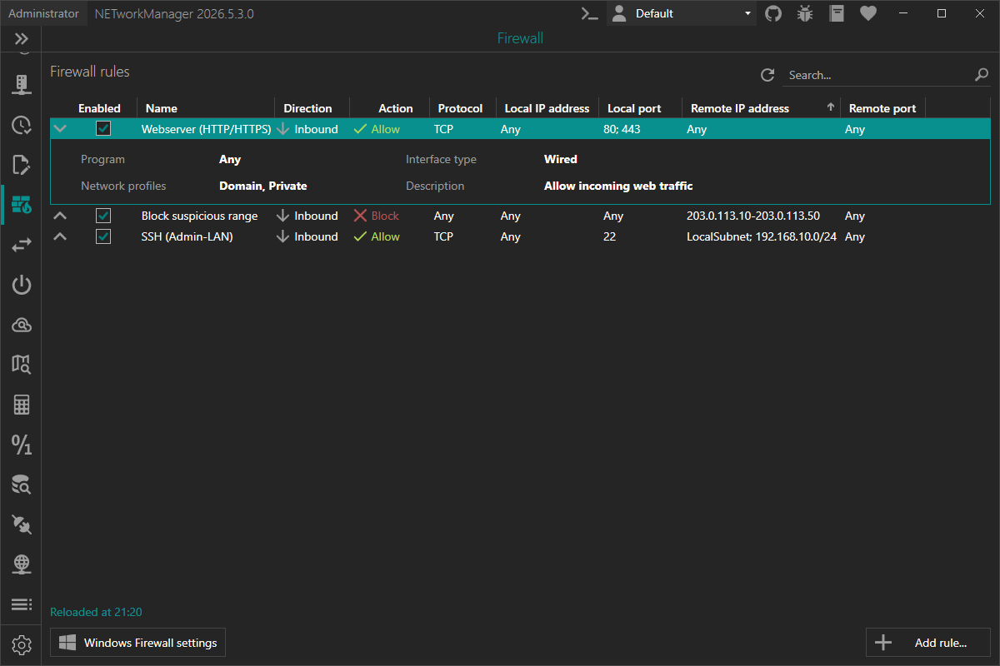

YomiNet introduces a new feature, the `Firewall`. You can now manage Windows Firewall rules created by YomiNet directly from within the app — no more jumping between MMC snap-ins for day-to-day tasks.

This is especially useful if you frequently spin up local services (lab environments, dev boxes, game servers, small internal tools) and need a quick and repeatable way to open or block ports, restrict traffic to specific IP ranges, or scope rules to profiles like **Domain**, **Private**, or **Public**.

<!-- truncate -->

## Manage rules safely (and without touching your system rules)

The Firewall view intentionally focuses on rules managed by YomiNet only.

Every rule created via YomiNet is stored with a `YomiNet_` prefix in the Windows Firewall rule display name. This makes it easy to distinguish "your" rules from system-managed or third-party rules — and it allows YomiNet to filter the list so you only see what it owns.

## What you can do with the new Firewall feature

- View firewall rules created by YomiNet
- Add new inbound or outbound rules
- Edit existing rules
- Enable or disable rules quickly
- Delete rules you no longer need
- Copy or export rule information
- Refresh the list with `F5`
- Open the native Windows Firewall console (`WF.msc`) via the **Windows Firewall Settings** button

## Add / Edit rules — with the options you actually need

When creating or editing a rule, YomiNet exposes the most common and important fields in a clear dialog:

- **Name**: Display name of the rule (the `YomiNet_` prefix is added automatically and hidden in the UI)
- **Enabled**: Whether the rule is active right after creation
- **Description**: Optional description of the rule
- **Direction**: Inbound / Outbound
- **Action**: Allow / Block
- **Protocol**: Any, TCP, UDP, ICMPv4, ICMPv6, GRE, L2TP
- **Local / Remote ports**: Available for TCP and UDP; multiple ports and ranges separated by `;`
- **Local / Remote addresses**: Supports single IPs, ranges, subnets (CIDR and subnet masks), and keywords such as `LocalSubnet` or `Internet`
- **Program**: Limit the rule to a specific executable (optional)
- **Interface type**: Any, Wired, Wireless, RemoteAccess
- **Network profiles**: Domain / Private / Public (at least one must be selected)

You can find all details (including examples for port and address formats) in the [official documentation](https://borntoberoot.net/YomiNet/docs/application/firewall).

## Administrator privileges

Managing firewall rules requires elevated rights. If YomiNet is not running as administrator, the Firewall view is **read-only**. Use the **Restart as administrator** button to relaunch YomiNet with the required privileges.

## Try it now

You can test this feature in the [latest pre-release of YomiNet](https://borntoberoot.net/YomiNet/download#pre-release).

If you find any issues or have suggestions for improvement, please open an [issue on GitHub](https://github.com/BornToBeRoot/YomiNet/issues).
